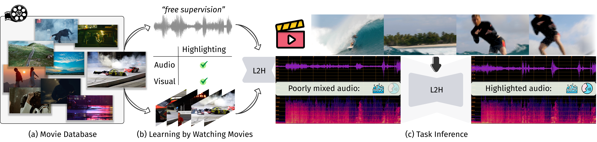

<h1 align="center">Learning to Highlight Audio by Watching Movies</h1>
<h5 align="center" style="color:gray">
  <a href="https://wikichao.github.io/" target="_blank">Chao Huang</a>,
  <a href="https://ruohangao.github.io/" target="_blank">Ruohan Gao</a>,
  <a href="#">J. M. F. Tsang</a>,
  <a href="#">Jan Kurcius</a>,
  <a href="https://scholar.google.fr/citations?user=6ETBT2AAAAAJ&hl=fr" target="_blank">Cagdas Bilen</a>,
  <a href="https://www.cs.rochester.edu/~cxu22/" target="_blank">Chenliang Xu</a>,
  <a href="https://anuragkr90.github.io/" target="_blank">Anurag Kumar</a>,
  <a href="https://sanjeelparekh.github.io/" target="_blank">Sanjeel Parekh</a><br>
</h5>
<h5 align="center" style="color:gray">
  University of Rochester, University of Maryland College Park, Meta Reality Labs Research
</h5>
<h5 align="center"> If our project helps you, please give us a star ⭐ on GitHub to support us. </h5>

<h5 align="center">
<a href="https://wikichao.github.io/VisAH/"></a>  
<a href=""></a>
<a href="https://wikichao.github.io/VisAH_Gallery/"></a>
<a href="https://drive.google.com/file/d/1lVqr7zBNaI1AupLz0X7dIWbiC8WULWP4/view?usp=sharing"></a>
<a href="https://drive.google.com/drive/folders/16gg4m3EDIdluJ_yonC9pc87dWZibSc9E?usp=sharing"></a>
<a href="https://huggingface.co/papers/2505.12154"></a>
</h5> 

## 📋 Table of Contents
- [📋 Table of Contents](#-table-of-contents)
- [📰 News](#-news)
- [📝 Overview](#-overview)
- [🛠️ Installation](#️-installation)
  - [1. Clone the repository and create environment](#1-clone-the-repository-and-create-environment)
  - [2. Install dependencies](#2-install-dependencies)
- [🤖 Dataset](#-dataset)
  - [1. Download "The Muddy Mix" Dataset](#1-download-the-muddy-mix-dataset)
    - [Download Options:](#download-options)
  - [2. Degradation Method](#2-degradation-method)
- [🗝️ Training](#️-training)
- [✅ Evaluation](#-evaluation)
  - [🌎 Pretrained model](#-pretrained-model)
- [🎯 Gallery](#-gallery)
- [🚀 Inference Examples](#-inference-examples)
- [❓ FAQ](#-faq)
- [👐 Contributing](#-contributing)
- [📧 Contact](#-contact)
- [👍 Acknowledgements](#-acknowledgements)
- [📑 Citation](#-citation)

## 📰 News

* **[2025.03]** 🔥🔥 Released training and evaluation codes for **VisAH**.
* **[2025.02]** 🎉🎉 **VisAH** is accepted to **CVPR 2025**.

## 📝 Overview

**VisAH** (Visually Guided Audio Highlighting) is a novel framework that learns to highlight important audio elements in movie scenes by leveraging visual cues. The approach addresses the challenge of automatically enhancing audio elements that align with visual content, improving the overall multimedia experience. This repository contains the unofficial implementation of the CVPR 2025 paper.

<p align="center">
  
</p>


## 🛠️ Installation

### 1. Clone the repository and create environment
Clone the repository and create a conda environment:
```bash
git clone https://github.com/WikiChao/VisAH.git
conda create --name VisAH python=3.10
conda activate VisAH
```

### 2. Install dependencies
Install dependencies:
```bash
git clone https://github.com/facebookresearch/ImageBind.git
cd ImageBind
pip install .
cd ..
python -m pip install lightning==2.3.0
pip install -U tensorboardX
pip install hear21passt
python3 -m pip install -U demucs
```

## 🤖 Dataset

### 1. Download "The Muddy Mix" Dataset

We have prepared all data and features needed to reproduce the training and evaluation process described in our paper.

#### Download Options:

**Option 1: Base Dataset (Recommended for Quick Start)**
- Contains essential files: visual features, text features, input audio, and ground truth audio
- [Download Base Dataset](https://drive.google.com/file/d/1lVqr7zBNaI1AupLz0X7dIWbiC8WULWP4/view?usp=sharing)
- After downloading, unzip and rename the folder from `Muddy_Mix_base` to `Muddy_Mix`
- Place it in the `visah/data/` directory

**Option 2: Full Dataset**
- Contains everything in the base dataset plus extracted frames, separated audios, and original video clips
- *Coming soon - please stay tuned*


**Directory structure**:
  ```
Muddy_Mix
├── _2EQFo-vIH0
|   ├── sub-video
│   |   ├── _2EQFo-vIH0_000
│   |   |     ├──audio_raw                     # Ground truth movie audio
│   |   |     |   ├──_2EQFo-vIH0_000.wav
│   |   |     ├──frames                        # Video frames
│   |   |     |   ├──001.png
│   |   |     |   ├──...
│   |   |     ├──frames_feats                  # Extracted visual features
│   |   |     |   ├──visual_feats.pt
│   |   |     ├──frames_captions               # Extracted textual features
│   |   |     |   ├──InternVL2-8B_prompt1_feats.pt
│   |   |     ├──remix_global                  # Mixed audio data
│   |   |     |   ├──...
│   |   |     |   ├──target_mix.wav
│   |   |     ├──separated                     # Separated wav files from original waveform
│   |   ├──_2EQFo-vIH0_000.mkv
  ```

---

### 2. Degradation Method
We generated the dataset once for the experiments in our paper. However, you can generate additional data for augmentation using the example in ``preprocessing/Degradation_generation.py``.


## 🗝️ Training

After setting your dataset path, start training with:


```bash
cd visah
python run_model.py --config configs/main_config.yaml
```

## ✅ Evaluation

To evaluate the model:
1. Set ``mode: test`` in ``configs/main_config.yaml``
2. Run:

```bash
python run_model.py --config configs/main_config.yaml
```

### 🌎 Pretrained model 
Download our pretrained model checkpoints from [here](https://drive.google.com/drive/folders/16gg4m3EDIdluJ_yonC9pc87dWZibSc9E?usp=sharing).

## 🎯 Gallery

Please refer to <a href="https://wikichao.github.io/VisAH_Gallery/" style="color: #3273dc; text-decoration: underline;">Gallery</a> that showcases audio highlighting results along with the original movie clips.

## 🚀 Inference Examples

To run inference on your own videos, follow these steps:

1. Prepare your video files and place them in the `input_videos` directory.
2. Run the inference script:

```bash
python run_inference.py --config configs/inference_config.yaml
```

3. The enhanced audio files will be saved in the `output_audio` directory.

## ❓ FAQ

- **Q:** Can I use a different dataset for training?
  - **A:** Yes, you can modify the dataset path in the configuration file and ensure the data format matches our requirements.

- **Q:** How can I contribute to this project?
  - **A:** Please refer to the [Contributing](#-contributing) section for guidelines.

## 👐 Contributing

We welcome contributions from the community! If you would like to contribute, please follow these steps:

1. Fork the repository
2. Create a new branch (`git checkout -b feature-branch`)
3. Make your changes
4. Commit your changes (`git commit -am 'Add new feature'`)
5. Push to the branch (`git push origin feature-branch`)
6. Create a new Pull Request

## 📧 Contact

If you have any questions or need further assistance, feel free to reach out to us:

- Chao Huang: chuang65@cs.rochester.edu

## 👍 Acknowledgements

We utilized code from the [bandit](https://github.com/kwatcharasupat/bandit) Cinematic Audio Source Separation repository for imperfect separation results generation.

## 📑 Citation
If you use this code for your research, please cite our work:
```
@inproceedings{huang2025learning,
  title={Learning to Highlight Audio by Watching Movies},
  author={Huang, Chao and Gao, Ruohan and Tsang, J. M. F. and Kurcius, Jan and Bilen, Cagdas and Xu, Chenliang and Kumar, Anurag and Parekh, Sanjeel},
  booktitle={CVPR},
  year={2025}
}
```
